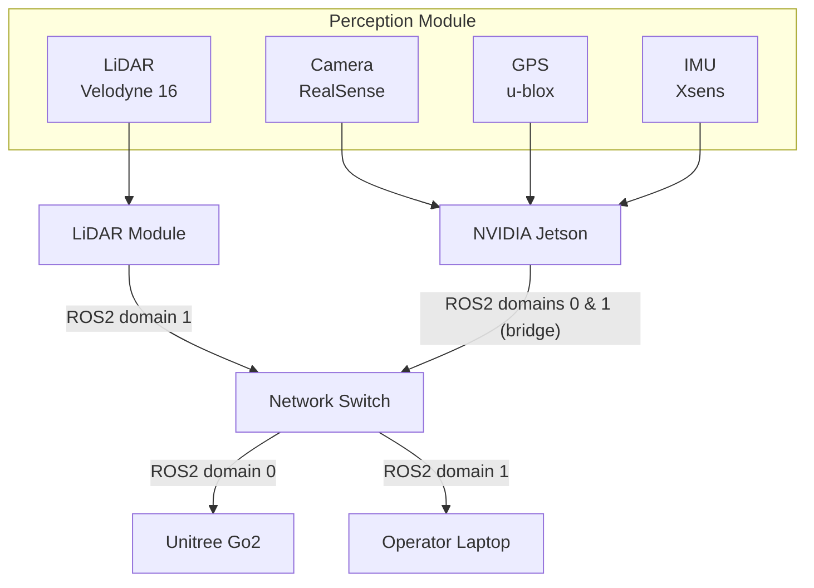

# Autonomous Perception & Navigation Module — Unitree Go2

*Multi-sensor perception stack (LiDAR, camera, IMU, GPS) and ROS2 integration for autonomous navigation on a quadruped robot.*

Developed as part of a robotics research project at Karlsruhe Institute of Technology (KIT).

## Overview

This project equips the Unitree Go2 quadruped robot with a full perception and autonomous navigation stack, enabling it to operate independently in indoor and outdoor environments and gather sensor data for on-site analysis.

> **Note:** This repository is a general technical overview shared for portfolio purposes. Task-by-task documentation and the project's specific research application are maintained in a private repository per my research group's policy, and are available on request.

## My Role

I worked across the full stack, with a primary focus on perception:

**Perception (primary focus)**
- Integrated and configured drivers for four sensor modalities: 3D LiDAR (Velodyne Puck 16), RGB-D camera (Intel RealSense), IMU (Xsens), and GNSS (u-blox)
- Deployed sensor processing on an NVIDIA Jetson for real-time, on-edge inference
- Built a PyTorch-based object detection pipeline (Ultralytics YOLO) that fuses camera detections with LiDAR point-cloud data to detect and localize objects of interest in 3D
- Designed the ROS2 network topology connecting the perception subsystem to the robot's native control domain (multi-domain setup across the LiDAR module, Jetson, robot, and operator laptop)

**Navigation & control**
- Implemented the ROS2 interface to command and monitor the Go2 robot
- Contributed to localization using the ROS2 Navigation stack (Nav2)
- Currently developing the autonomous navigation / path execution logic

## Architecture

The Jetson bridges the perception network (domain 1) with the robot's native ROS2 domain (domain 0), so perception outputs can inform the navigation commands sent to the Go2.

## Tech Stack

| Category | Tools |
|---|---|
| Middleware | ROS2 |
| Navigation | Nav2 |
| Edge compute | NVIDIA Jetson |
| Perception / ML | Ultralytics YOLO (PyTorch) |
| Sensors | Velodyne Puck 16 (LiDAR), Intel RealSense (camera), Xsens (IMU), u-blox (GNSS) |
| Robot platform | Unitree Go2 |

## Status

| Component | Status |
|---|---|
| Camera driver | ✅ Done |
| LiDAR driver | ✅ Done |
| IMU driver | ✅ Done |
| GPS driver | ✅ Done |
| Robot driver / ROS2 control | ✅ Done |
| Object detection  | ✅ Done |
| Nav2 localization | 🔄 In progress |
| Autonomous navigation script | ⏳ Planned |

